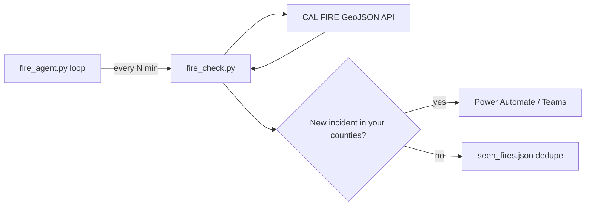

# Fire Alert Agent (CAL FIRE)

This project is a **background monitoring agent** for [CAL FIRE active incidents](https://incidents.fire.ca.gov/). It reads the same public GeoJSON feed the website uses (no browser scraping, no API key), watches counties you choose, and sends **Microsoft Teams** alerts when a **new** fire appears.

Default region: **San Diego County** (change via `MONITOR_COUNTIES` in `.env`).

Alerts go to **Power Automate** (HTTP trigger URL in `.env`). Optional Teams webhook is also supported.

No paid API is required.

**Choosing how to deploy?** See **[docs/DEPLOYMENT_OPTIONS.md](docs/DEPLOYMENT_OPTIONS.md)** for a full comparison (manual vs local agent vs cloud vs AI), pros/cons, and diagrams for stakeholder review.

## How it works



- **`fire_check.py`** — one check: fetch feed, filter counties, alert on new fires
- **`fire_agent.py`** — runs checks on a schedule until you stop it (or use `install_agent.sh` for auto-start on macOS)
- **`seen_fires.json`** — remembers incidents already alerted so you are not spammed

You do **not** need a literal “go to the website” browser agent. The official API is more reliable than scraping HTML.

## Step-by-step setup (for a new person)

### 1) Clone the repo

```bash
git clone <your-repo-url>
cd SDFireCoordinateProject
```

### 2) Create and activate a virtual environment (recommended)

macOS/Linux:

```bash
python3 -m venv .venv
source .venv/bin/activate
```

Windows (PowerShell):

```powershell
python -m venv .venv
.venv\Scripts\Activate.ps1
```

### 3) Install dependencies

```bash
pip install -r requirements.txt
```

### 4) Create a local `.env` file

Copy the template:

```bash
cp .env.example .env
```

Edit `.env` and set:

```env
POWER_AUTOMATE_WEBHOOK_URL=https://...powerplatform.com/.../triggers/manual/paths/invoke?...
MONITOR_COUNTIES=san diego
CHECK_INTERVAL_MINUTES=5
```

Notes:
- `POWER_AUTOMATE_WEBHOOK_URL` — copy the **HTTP POST URL** from your Power Automate flow trigger (“When a HTTP request is received” or manual trigger).
- For the **“Send webhook alerts to General”** Teams template, the script sends Teams adaptive-card JSON (`type: message` + `attachments`). Plain `subject`/`body` JSON will cause the flow to fail.
- Optional: `TEAMS_WEBHOOK_URL` for direct Teams posts (used only if Power Automate is not set).
- `MONITOR_COUNTIES` — comma-separated lowercase substrings (e.g. `san diego, orange`). Leave empty to monitor all of California.
- Treat webhook URLs like passwords; never commit `.env`.

### 5) Send one test alert now

```bash
python3 fire_check.py --test
```

This triggers your Power Automate flow once and confirms:
- CAL FIRE feed access
- Webhook delivery

### 6) Run the monitoring agent (recommended)

Keep a terminal open and check every 5 minutes:

```bash
python3 fire_agent.py
```

Single check (no loop):

```bash
python3 fire_agent.py --once
# or: python3 fire_check.py
```

### 7) Run in the background on macOS (optional)

After `.env` is configured and `--test` works:

```bash
chmod +x install_agent.sh
./install_agent.sh
```

Logs go to `agent.log`. To stop: `launchctl bootout gui/$(id -u)/com.sdfire.agent`

## Run automatically with GitHub Actions

This repo includes a GitHub Actions workflow that checks CAL FIRE every 5 minutes.

To enable it:

1. Go to your GitHub repo.
2. Open **Settings** > **Secrets and variables** > **Actions**.
3. Click **New repository secret**.
4. Name it `TEAMS_WEBHOOK_URL`.
5. Paste your Microsoft Teams webhook URL as the secret value.
6. Open the **Actions** tab.
7. Select **Fire Alert Check**.
8. Click **Run workflow** once to test it.

The workflow runs `python fire_check.py`, posts new alerts to Teams, and commits `seen_fires.json` back to the repo so the next scheduled run does not send duplicates.

GitHub schedules can be delayed, so "every 5 minutes" may not be exact to the second.

## Run automatically with Azure Functions

Azure Functions can run the checker on a timer without keeping your computer on. This repo includes:

- `function_app.py` for the 5-minute timer trigger
- `host.json` for the Azure Functions runtime
- Azure Blob Storage-backed state so duplicate alerts are remembered between runs

The timer schedule is:

```python
schedule="0 */5 * * * *"
```

That means every 5 minutes.

High-level setup:

1. Create an Azure Function App for Python.
2. Use a plan that supports timer triggers, such as the Consumption plan.
3. Add this application setting in the Function App:

```text
TEAMS_WEBHOOK_URL=your Teams webhook URL
```

4. Deploy this repo to the Function App.
5. In Azure, open the function logs and confirm `fire_alert_check` is running every 5 minutes.

Azure Functions requires a storage account for timer triggers. The script also uses that same storage connection, `AzureWebJobsStorage`, to save `seen_fires.json` in a blob container named `fire-alert-state`.

If you switch to Azure Functions, disable the GitHub Actions workflow so both systems do not send duplicate alerts.

## Change where alerts go

Update `POWER_AUTOMATE_WEBHOOK_URL` in `.env`, then run:

```bash
python3 fire_check.py --test
```

## Change monitored region

Edit `MONITOR_COUNTIES` in `.env`:

```env
# San Diego only (default)
MONITOR_COUNTIES=san diego

# Several counties
MONITOR_COUNTIES=san diego, los angeles, orange

# All of California (leave empty)
MONITOR_COUNTIES=
```

Restart the agent after changing `.env`.

## Troubleshooting

- **No notification received**
  - Confirm `.env` exists and `POWER_AUTOMATE_WEBHOOK_URL` is copied exactly
  - In Power Automate, open the flow run history and confirm the test run succeeded
  - Add actions after the trigger (email, Teams, mobile notification) if the flow only receives HTTP today
- **0 county matches in test alert**
  - This can be normal if CAL FIRE currently has no active incidents in monitored counties

## Security

- Never commit `.env`
- `.env` is ignored by `.gitignore`
- Keep `.env.example` as placeholders only
- Treat your Teams webhook URL like a password
