# CAL FIRE Alert System — Deployment Options Guide

**Purpose:** Help stakeholders choose how to run the San Diego fire monitoring and Teams alerting system.

**Project:** SDFireCoordinateProject  
**Data source:** [CAL FIRE public incident API](https://incidents.fire.ca.gov/) (same data as the public website; no browser automation)  
**Notifications:** Microsoft Power Automate → Teams channel **General** (adaptive cards)

---

## Executive summary

| What exists today | What still needs a decision |
|-------------------|---------------------------|
| Working Python monitor (`fire_check.py`) | **Where** it runs (laptop vs cloud) |
| Power Automate → Teams integration (tested) | **How often** it checks (default: every 5 minutes) |
| County filtering (default: San Diego) | Whether to add **AI** (usually not needed for alerts) |

**Bottom line:** The hard part (data + alerts) is done. The choice is **how to keep it running 24/7** with acceptable cost, reliability, and IT overhead.

---

## What the system does (all options share this core)

Every deployment option uses the same logical pipeline:

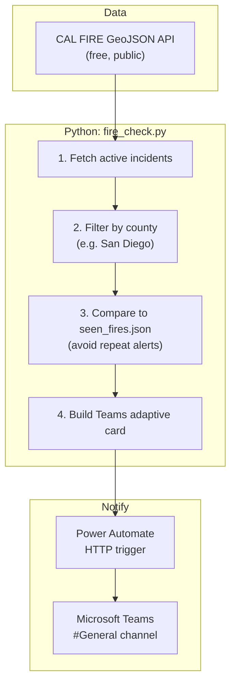

### Behaviors that are the same in every option

| Behavior | Description |
|----------|-------------|
| **No website scraping** | Reads official JSON API — faster and more stable than automating a browser |
| **County filter** | Only alerts for counties listed in `MONITOR_COUNTIES` (default: `san diego`) |
| **New fires only** | `seen_fires.json` stores incident IDs already alerted |
| **Rich Teams cards** | Title + details (name, coordinates, acres, containment, Google Maps link) |
| **No CAL FIRE API key** | Public feed; no subscription cost |

### What is *not* included unless you choose a specific option

| Capability | Manual | Local agent | Cloud | AI agent |
|------------|:------:|:-----------:|:-----:|:--------:|
| Runs without human starting it | ❌ | ✅ | ✅ | ✅ |
| Runs when laptop is off | ❌ | ❌ | ✅ | ✅ |
| Natural-language Q&A | ❌ | ❌ | ❌ | ✅ |
| Extra monthly cost | $0 | $0 | $0–low | $$$ |

---

## Option 0 — Manual checks (current baseline)

**What it is:** Someone runs a command when they want to check. No background process.

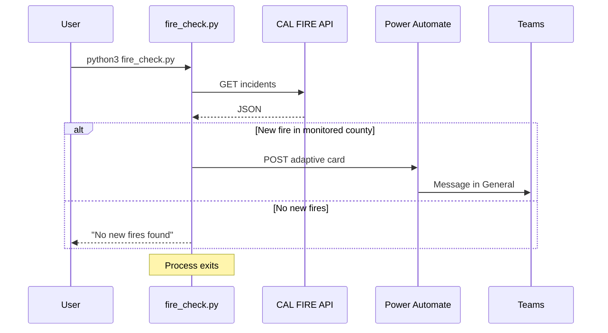

### How to run

```bash
python3 fire_check.py          # check once, alert if new
python3 fire_check.py --test     # send one test card to Teams
```

### Pros

| Pro | Why it matters |
|-----|----------------|
| **Simplest** | No install, no cloud account, no scheduling |
| **Zero ongoing ops** | Nothing running in the background |
| **Easy to demo** | Good for proving the integration works |
| **Free** | No hosting costs |

### Cons

| Con | Why it matters |
|-----|----------------|
| **Not real-time monitoring** | Fires can appear between manual runs |
| **Human dependency** | Easy to forget to run |
| **Not suitable for operations** | Misses overnight / weekend incidents |

### Best for

- Proof of concept and stakeholder demos  
- Occasional manual checks  
- **Not** recommended for production alerting  

### Effort to deploy

| Item | Estimate |
|------|----------|
| Setup time | Already done |
| Ongoing maintenance | None |
| Technical skill | Run one terminal command |

---

## Option 1 — Local background agent (Mac / PC always on)

**What it is:** A loop runs `fire_check.py` every N minutes (default 5) on a computer that stays powered on.

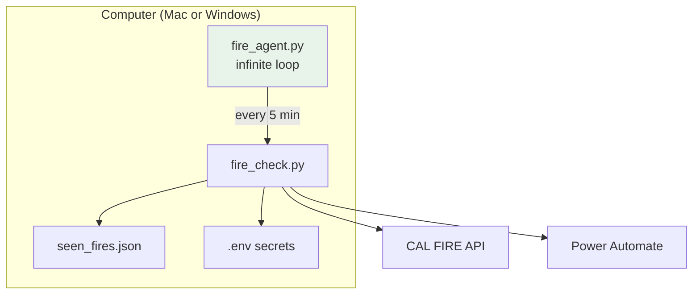

### Two sub-options

#### 1A — Foreground agent (terminal open)

```bash
python3 fire_agent.py
```

- Stops when terminal closes or Mac sleeps (unless configured otherwise)

#### 1B — macOS LaunchAgent (recommended on Mac)

```bash
./install_agent.sh
```

- Starts at login, restarts if crash, logs to `agent.log`

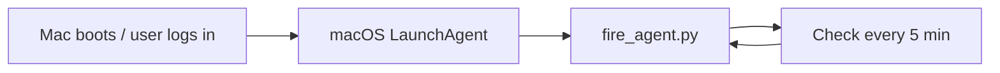

### Pros

| Pro | Why it matters |
|-----|----------------|
| **True 24/7 while machine is on** | Catches new fires within ~5 minutes |
| **Already built in repo** | `fire_agent.py` + `install_agent.sh` exist |
| **Free** | No cloud hosting bill |
| **Full control** | Logs on disk, easy to debug |
| **Uses existing Power Automate flow** | No change to Teams setup |

### Cons

| Con | Why it matters |
|-----|----------------|
| **Machine must stay on** | Laptop closed / asleep = no checks |
| **Power / network outages** | Gaps in coverage |
| **Single point of failure** | One computer, one operator |
| **Not ideal for teams** | Tied to one person's device unless moved to a server |

### Best for

- Individual or small team with a Mac Mini / always-on office PC  
- Low budget, quick path to production  
- UCSD / lab machine that stays powered  

### Effort to deploy

| Item | Estimate |
|------|----------|
| Setup time | 15–30 minutes |
| Ongoing maintenance | Occasional log checks; update `.env` if webhook rotates |
| Technical skill | Basic terminal; macOS `launchctl` for 1B |

### Risks & mitigations

| Risk | Mitigation |
|------|------------|
| Mac sleeps | Energy settings: prevent sleep on power; use desktop/Mac Mini |
| Webhook URL leaked | Rotate in Power Automate; never commit `.env` |
| Disk fills with logs | Rotate `agent.log` periodically |

---

## Option 2 — Cloud-scheduled monitor (laptop independent)

**What it is:** The **same** `fire_check.py` logic runs on a schedule in the cloud. The cloud platform is the “timer”; you usually run **one check per invocation** (not an infinite loop).

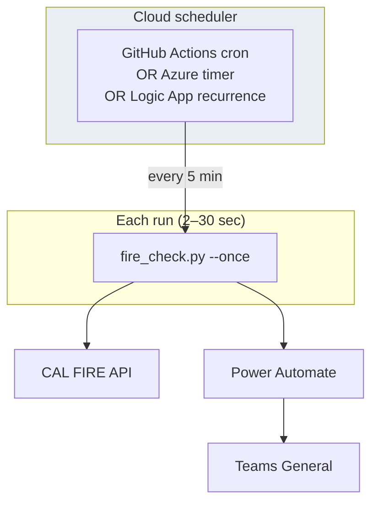

### Sub-options compared

#### 2A — GitHub Actions (recommended cloud starter)

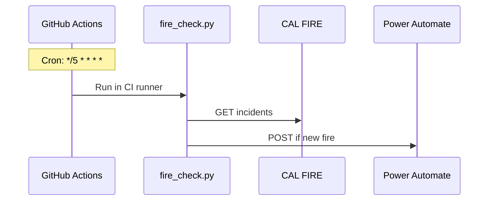

| Pros | Cons |
|------|------|
| Free for public repos; generous free tier for private | Need GitHub repo + secrets setup |
| No server to manage | `seen_fires.json` must persist (commit artifact or use cache) |
| Runs when laptop is off | ~1–5 min schedule granularity (not millisecond-precise) |
| Good audit trail (workflow logs) | Requires basic CI familiarity |

**Typical cost:** $0/month (within free tier)

---

#### 2B — Microsoft Power Automate / Logic Apps only (no Python)

Rebuild the pipeline entirely in Power Automate: recurrence → HTTP GET CAL FIRE → parse JSON → condition → post Teams.

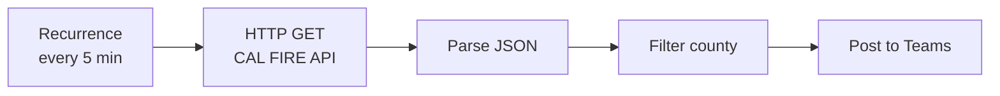

| Pros | Cons |
|------|------|
| Stays in Microsoft 365 ecosystem | **Re-implement** deduplication logic in flow |
| No Python hosting | Complex JSON parsing in low-code designer |
| Uses existing Teams connection | Harder to version-control and test |
| | Flow run limits on license tier |

**Typical cost:** $0 if included in existing M365; check Premium connector limits

---

#### 2C — Azure Function / small VPS

Run Python on Azure Functions (timer trigger) or a $5–6/mo Linux VPS with `cron` + `fire_agent.py --once`.

| Pros | Cons |
|------|------|
| Most control, production-grade | Higher setup complexity |
| Persistent storage for `seen_fires.json` easy | May incur monthly cost (VPS or Azure) |
| Custom intervals | Needs someone comfortable with Azure/Linux |

**Typical cost:** $0–15/month

---

### Option 2 — Overall pros & cons

### Pros

| Pro | Why it matters |
|-----|----------------|
| **Works when staff laptops are off** | Reliable for operations |
| **Team-visible** | Not tied to one person's Mac |
| **Same alert quality** | Still uses Power Automate → Teams |
| **Scales to many counties** | Just config change |

### Cons

| Con | Why it matters |
|-----|----------------|
| **More setup than Option 1** | Secrets, CI, or Azure knowledge |
| **`seen_fires.json` in cloud** | Must persist state between runs (artifact/cache/DB) |
| **Secrets management** | Webhook URL in GitHub Secrets / Key Vault |
| **Slight delay possible** | Cron jitter (e.g. 5–7 min between checks) |

### Best for

- Production alerting for a team or organization  
- Stakeholders who need reliability without a dedicated machine  
- UCSD / departmental use where a Mac cannot stay on 24/7  

### Effort to deploy

| Sub-option | Setup time | Skill level |
|------------|------------|-------------|
| GitHub Actions | 1–2 hours | GitHub + YAML basics |
| Power Automate only | 2–4 hours | Power Automate intermediate |
| Azure / VPS | 4–8 hours | Cloud or Linux admin |

---

## Option 3 — AI agent (LLM-driven)

**What it is:** A large language model (ChatGPT, Cursor Agent, Copilot, etc.) orchestrates tools — including optionally calling the fire monitor — and can answer questions in natural language.

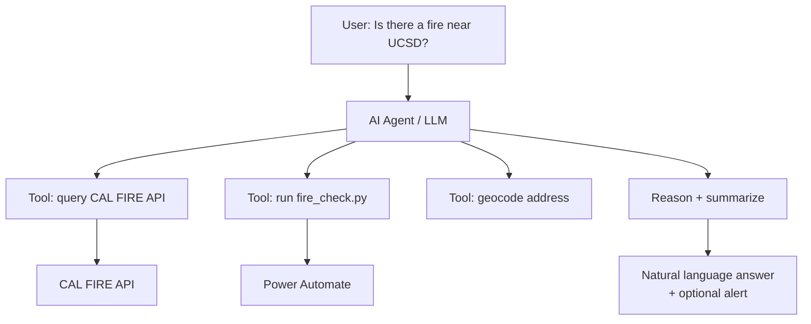

### Example capabilities AI could add

- “Summarize all active fires in Southern California.”  
- “Is this incident within 20 miles of our facility?”  
- “What changed since yesterday?”  
- Draft incident reports for leadership  

### Pros

| Pro | Why it matters |
|-----|----------------|
| **Flexible questions** | Not limited to fixed alert rules |
| **Rich explanations** | Good for executives and public comms drafts |
| **Can combine sources** | Weather, maps, news (if tools added) |

### Cons

| Con | Why it matters |
|-----|----------------|
| **Overkill for simple alerts** | “Notify me on new fire” does not need AI |
| **Ongoing API cost** | Per-token charges |
| **Non-deterministic** | Can hallucinate; not ideal for life-safety alone |
| **More engineering** | Tools, guardrails, monitoring, evals |
| **Compliance / review** | May need human approval for operational messages |

### Best for

- Research, situational awareness dashboards, Q&A interfaces  
- **Not** recommended as the **only** alerting path for emergencies  

### Recommended architecture if AI is desired later

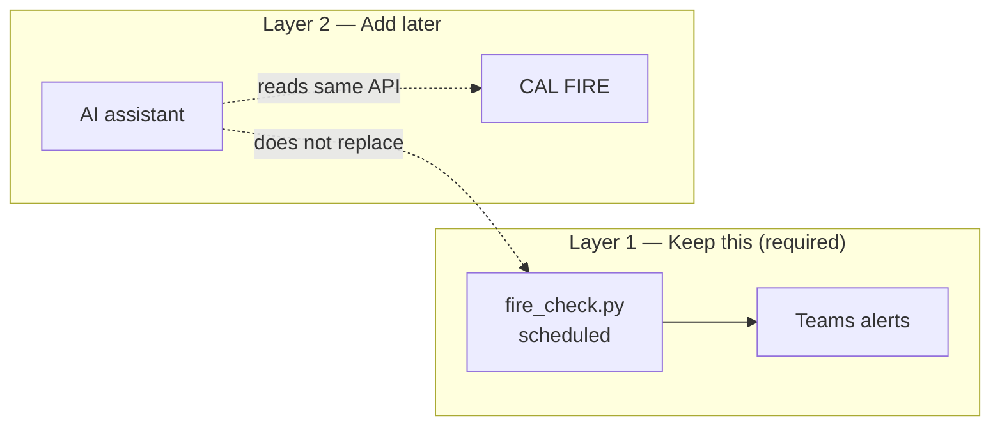

**Rule:** Use **Option 1 or 2** for alerts; add **Option 3** only as a separate assistant on top.

### Effort to deploy

| Item | Estimate |
|------|----------|
| MVP assistant | 1–2 weeks |
| Production-grade (guardrails, evals) | 1–3 months |
| Typical monthly cost | $20–200+ depending on usage |

---

## Side-by-side decision matrix

### Reliability & operations

| Criterion | Option 0 Manual | Option 1 Local agent | Option 2 Cloud | Option 3 AI |
|-----------|:---------------:|:--------------------:|:--------------:|:-----------:|
| 24/7 monitoring | ❌ | ⚠️ (if machine on) | ✅ | ⚠️ (depends on host) |
| Works laptop closed | ❌ | ❌ | ✅ | ✅ |
| Alert latency ~5 min | ❌ | ✅ | ✅ | N/A |
| Deterministic / testable | ✅ | ✅ | ✅ | ⚠️ |
| Ops complexity | Low | Low–Med | Med | High |

### Cost (typical)

| Option | Software | Hosting | People time |
|--------|----------|---------|-------------|
| 0 Manual | $0 | $0 | Low |
| 1 Local agent | $0 | $0 (existing PC) | Low |
| 2A GitHub Actions | $0 | $0 | Medium setup |
| 2B Power Automate only | $0* | $0 | Medium–High setup |
| 2C Azure / VPS | $0 | $0–15/mo | High setup |
| 3 AI agent | $20–200+/mo | Varies | High |

\*Assumes existing Microsoft 365 / Power Automate licensing.

### Security & compliance

| Topic | All options |
|-------|-------------|
| **Secrets** | `POWER_AUTOMATE_WEBHOOK_URL` must stay private (like a password) |
| **Data** | Public CAL FIRE data only; no PII in feed |
| **Teams** | Uses org Microsoft 365; aligns with existing UCSD identity (`nkasibatla@ucsd.edu`) |
| **Audit** | Cloud options (GitHub/Azure) provide run logs; local uses `agent.log` |

---

## High-level architecture comparison (one diagram)

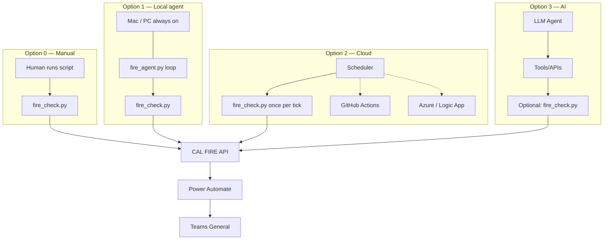

---

## What is already built (inventory)

| Component | Status | Role |
|-----------|--------|------|
| `fire_check.py` | ✅ Working | Core: fetch, filter, dedupe, notify |
| `fire_agent.py` | ✅ Working | Local scheduler loop |
| `install_agent.sh` | ✅ Ready | macOS auto-start |
| Power Automate → Teams | ✅ Tested | Notifications to General |
| `.env` configuration | ✅ Working | Counties, webhook, interval |
| `seen_fires.json` | ✅ Working | Dedup memory |
| GitHub Actions workflow | ❌ Not yet | Would enable Option 2A |
| AI / LLM layer | ❌ Not yet | Option 3 only |

---

## Recommendations by stakeholder priority

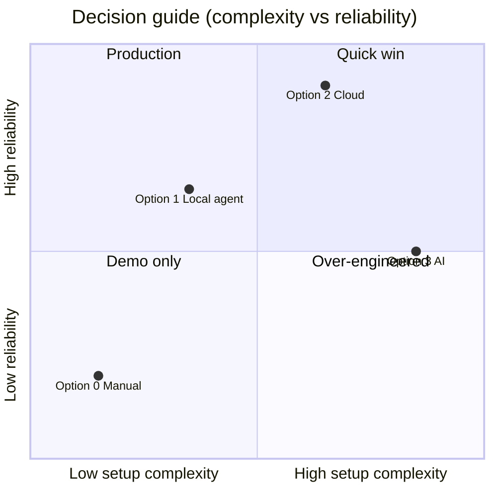

| If the priority is… | Recommended option |
|---------------------|-------------------|
| **Fastest path to 24/7 alerts this week** | **Option 1B** — `./install_agent.sh` on an always-on Mac |
| **Team reliability, laptop-independent** | **Option 2A** — GitHub Actions |
| **Stay 100% inside Microsoft 365** | **Option 2B** — Power Automate-only flow |
| **Demo / pilot only** | **Option 0** — manual runs |
| **Chatbot / “ask about fires”** | **Option 3** — only after Option 1 or 2 is live |

### Suggested phased rollout

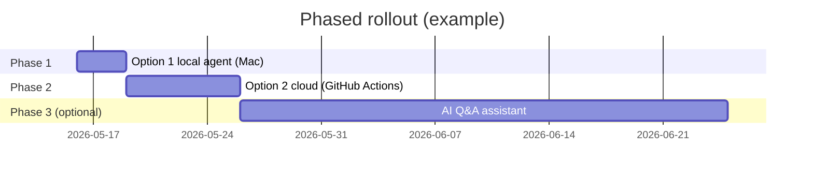

1. **Week 1:** Option 1 — prove 24/7 alerts on one always-on machine.  
2. **Week 2–3:** Option 2 — migrate to cloud if Mac reliability is insufficient.  
3. **Later (optional):** Option 3 — AI layer for analysis, not primary alerting.

---

## Decision checklist (for the meeting)

Use this checklist when presenting to decision-makers:

- [ ] **Who must receive alerts?** (Individuals vs team channel — today: Teams General)
- [ ] **Must alerts work overnight and weekends?** (If yes → reject Option 0)
- [ ] **Is there an always-on computer?** (If yes → Option 1 is attractive)
- [ ] **If no always-on computer →** Option 2 required
- [ ] **Acceptable alert delay?** (Default 5 minutes is configurable)
- [ ] **Budget for hosting / AI?** ($0 vs $5–15/mo vs AI API costs)
- [ ] **Who maintains it?** (Name a primary + backup owner)
- [ ] **Need natural-language Q&A?** (If no → skip Option 3)
- [ ] **Regulatory / audit requirements?** (Favor Option 2 with logged runs)

---

## Quick reference — commands by option

| Option | How to run |
|--------|------------|
| **0 Manual** | `python3 fire_check.py` |
| **1A Foreground agent** | `python3 fire_agent.py` |
| **1B macOS background** | `./install_agent.sh` |
| **2 Cloud** | Not yet in repo — requires GitHub Actions / Azure setup |
| **3 AI** | Not in repo — separate project |

**Test Teams integration (any option):**

```bash
python3 fire_check.py --test
```

---

## Glossary

| Term | Meaning |
|------|---------|
| **Agent (this project)** | A program that runs repeatedly without human intervention — not necessarily artificial intelligence |
| **AI agent** | Software using an LLM to plan steps and use tools |
| **Dedupe** | `seen_fires.json` prevents alerting twice on the same incident |
| **GeoJSON** | JSON format for geographic data returned by CAL FIRE |
| **Power Automate** | Microsoft workflow that receives HTTP POST and posts to Teams |
| **Adaptive card** | Rich message format required by the Teams webhook flow |

---

## Document info

| Field | Value |
|-------|-------|
| Version | 1.0 |
| Date | May 16, 2026 |
| Repository | SDFireCoordinateProject |
| Contact | Project owner / primary maintainer |

---

*For setup instructions, see [README.md](../README.md).*
